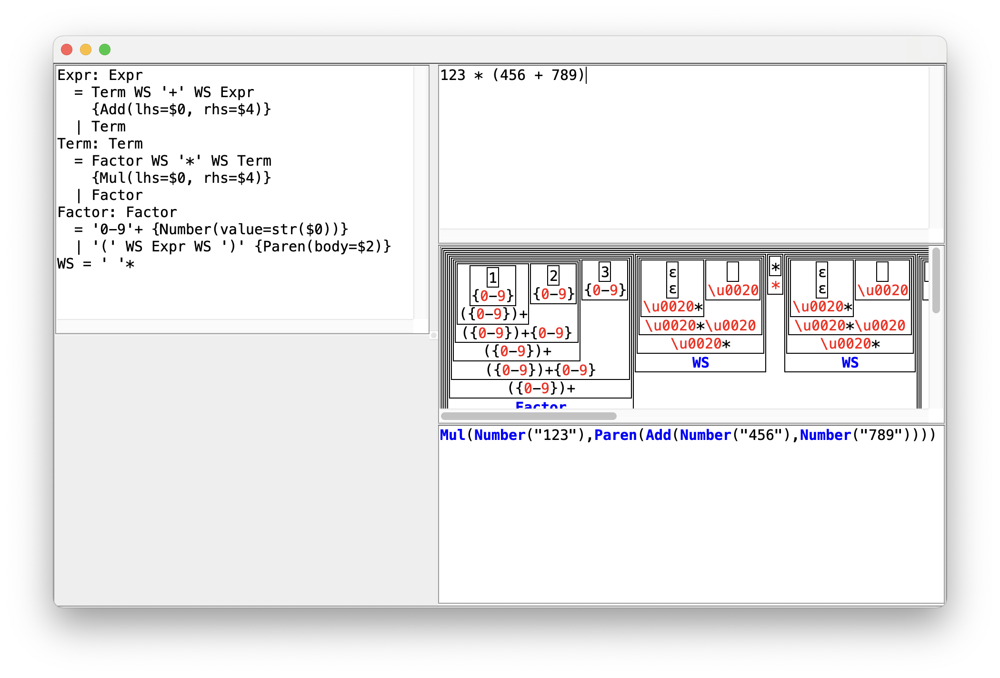

# J Parser

Parser generator for Conditional Derivation Grammar


## Conditional Derivation Grammar

Conditional Derivation Grammar(CDG) is an extension for Context-Free Grammar(CFG).

The overall structure of CDG looks similar to CFG. The following shows a typical expression grammar written in CDG.

```
Expr = Term | Expr '+\-' Term
Term = Factor | Term '*/' Factor
Factor = Number | '(' Expr ')'
Number = '1-9' '0-9'*
```

A nonterminal name should be a string of English alphabet letters and digits, with the first letter being a letter. Note that all nonterminal names are treated equally, no matter whether the first letter is upper case or lower case, etc.

The equal symbol(`=`) is the delimiter between left-hand-side and right-hand-side and the vertical bar(`|`) is the delimiter between the derivation rules.

A single quote represents a single character. `'*/'` is matched to `*` or `/`. You can specify a range like `'1-9'`, that means any character from `1` to `9`. Ranges and characters may be in a single symbol, e.g. `'_a-bA-B0-9'`. Since the hyphen represents a range, `\` must come before `-` to represent the hyphen letter, as in `'+\-'`.


In addition to the terminal and nonterminal symbols, CDG has 5 _conditional nonterminals_ as follows:

* `A&B` is an intersection symbol. It matches to a string if the string is matched to both `A` AND `B`.
* `A-B` is an exclusion symbol. It matches to a string if the string is matched to `A`, but not to `B`.
* `^A` is a followed-by symbol. It is matched to an empty string if there exists a following substring that is matched to `A`.
* `!A` is a not-followed-by symbol. It is matched to an empty string if there exists NO following substring that is matched to `A`.
* `<A>` is a longest match symbol. It is matched to a string if the string is matched to `A`, and there is no longer match.


The following shows a CDG that imitates the lexical analyzers.

```
S = token*
token = keyword | operator | identifier
keyword = ("if" | "else") & name
operator = <op>
op = '+' | "++"
identifier = name - keyword
name = <['A-Za-z' '0-9A-Za-z'*]>
```

The conventional lexical analyzers such as lex and flex have the longest match policy and priorities among tokens. These policies cannot be modeled with CFG but can be described with CDG as shown in the above example.

Here is a selection of example strings for this grammar:

* `abc` is an `identifier`; it is a `name` but not `keyword`.
* `if` is a `keyword`; it is `name` and it is `"if"`.
* `ifx` is an `identifier`; `ifx` is a `name` and it is not a `keyword` even though `ifx` starts with `if`.
* `++` is an `operator`; it could have been two `+` if `operator` was `op`, not `<op>`.
* `+++` is two `operator`s of `++` and `+`.


CDG can describe the languages that cannot be described with CFG. The following example shows the CDG definition for the language $\lbrace a^n b^n c^n | n \ge 1 \rbrace$, which is a typical example of a non context-free language.

```
S = (AB 'c'+)&('a'+ BC) {str($0)}
AB = "ab" | 'a' AB 'b'
BC = "bc" | 'b' BC 'c'
```


## Abstract Syntax Tree

You can describe the rules for constructing Abstract Syntax Trees, or ASTs in the CDG definition.

```
Expr: Expr
  = Term WS '+' WS Expr {Add(lhs=$0, rhs=$4)}
  | Term
Term: Term
  = Factor WS '*' WS Term {Mul(lhs=$0, rhs=$4)}
  | Factor
Factor: Factor
  = '0-9'+ {Number(value=str($0))}
  | '(' WS Expr WS ')' {Paren(body=$2)}
WS = ' '*
```

If you parse the input string `123 * (456 + 789)`, you will get `Mul(Number(123), Paren(Add(Number(456), Number(789))))`.

* An expression between a pair of curly brackets describes the rule for creating an AST node.
* `Add(...)`, `Mul(...)`, `Number(...)`, `Paren(...)` are the class initializer.
* `$0` and `$4` represents other symbols in the same sequence. The index is 0-based.
* The created ASTs will not contain the information of the symbols that are not referred. For example, `Add` class does not have the information about the WS symbols between the operator and operands.
* `Expr: Expr`, `Term: Term`, `Factor: Factor` defines the type of the symbols, that means, Expr symbol is type of the class named Expr, and so on.
* JParser's AST generator infers the type relations from the definition as much as possible.
  * In the example above, `Expr` class should be the super class of `Add` class and `Term` class. `Term` class should be the super class of `Mul` and `Factor`, and so on.
* You can generate the Kotlin codes defining the classes for the AST and the code that converts a parse tree to a generated AST class instance.


## More examples

Here is a selection of CDG examples:

* [json](https://github.com/Joonsoo/jparser/blob/main/examples/metalang3/resources/json/grammar.cdg): The famous [JSON grammar](https://www.json.org/json-en.html). The grammar of JSON can be described with CFG only.
* [asdl](https://github.com/Joonsoo/jparser/blob/main/examples/metalang3/resources/asdl/grammar.cdg): [Abstract Syntax Description Language](https://asdl.sourceforge.net/). This is used by [Python's ast module](https://docs.python.org/ko/3/library/ast.html).
* [proto3](https://github.com/Joonsoo/jparser/blob/main/examples/metalang3/resources/proto3/grammar.cdg): [Protocol buffer version 3 schema definition language](https://protobuf.dev/reference/protobuf/proto3-spec/).
* [metalang3](https://github.com/Joonsoo/jparser/blob/main/examples/metalang3/resources/metalang3/grammar.cdg): The grammar of CDG.
* [bibix](https://github.com/Joonsoo/bibix/blob/main/grammar/bibix.cdg): The grammar of the build script of [bibix build system](https://github.com/Joonsoo/bibix).
* [hexman](https://github.com/Joonsoo/hexman/blob/main/grammar/hexman.cdg): [Hexman](https://github.com/Joonsoo/hexman) is a binary format definition language.
* [sugarproto](https://github.com/Joonsoo/sugarproto/blob/main/grammar/sugarproto.cdg): [SugarProto](https://github.com/Joonsoo/sugarproto) is an enhancement for the Protocol Buffer 3 grammar.
* [jsontype](https://github.com/Joonsoo/jsontype/blob/main/grammar/jsontype.cdg): [jsontype](https://github.com/Joonsoo/jsontype) is a language for describing JSON object types.
<!--
  * [Compiler tutorial book](https://github.com/Joonsoo/compilerproject)
  * [autodb](https://github.com/Joonsoo/autodb3)
-->


## How to run

* JParser can be built and run using [bibix](https://github.com/Joonsoo/bibix).
* JParser provides an UI to test grammars. In order to run the UI, run `bibix visualize.parserStudio` on the jparser repository directory.
  * You can see the following screen, if the build was successful:
  * 
  * You can enter your grammar definition to the panel on the left. The text editor on the right top is for the example strings. The parse tree will be shown on the panel below. The panel at the right bottom shows the AST.

* You can generate the parser code using bibix rule `genKtAstMgroup2`. The following shows a typical example of generating the parser using jparser and defining the parser module from the generated code and data.

```
from bibix.plugins import ktjvm
import git("https://github.com/Joonsoo/jparser.git") as jparser

parserGen = jparser.genKtAstMgroup2(
  cdgFile = "grammar/hexman.cdg",
  astifierClassName = "com.giyeok.hexman.HexManAst",
  parserDataFileName = "hexman-mg2-parserdata.pb",
)

action generate {
  file.clearDirectory("parser/generated/resources")
  file.clearDirectory("parser/generated/kotlin")
  file.copyDirectory(parserGen.srcsRoot, "parser/generated/kotlin")
  file.copyFile(parserGen.parserData, "parser/generated/resources")
}

generated = ktjvm.library(
  srcs = glob("parser/generated/kotlin/**.kt"),
  deps = [jparser.ktparser.main],
  resources = ["parser/generated/resources/hexman-mg2-parserdata.pb"]
)

main = ktjvm.library(
  srcs = glob("parser/main/kotlin/**.kt"),
  deps = [generated]
)
```


## See also

* I have been writing a series of [blog postings](https://giyeok.com/categories.html#jparser) about jparser (in Korean).
  * This series covers from the introduction to parsing, CDG, naive CDG parsing algorithm, accept condition, parse tree reconstruction algorithm, faster milestone algorithm, even faster milestone group algorithm, AST processors, and so on.
  * I am still writing the series, and some of the uploaded postings are uncompleted.


* You can find the examples of CDG under the [examples/metalang3/resources](examples/metalang3/resources) directory.
  * I have tried to define the grammars of practical programming languages such as Java, Kotlin, and Dart. I believe it should be possible to define the grammars of those languages in CDG. It was successful to some extent, but I am not actively working on finishing those grammars at the moment.


## Notes

* JParser is implemented in Scala and Kotlin. I first started writing it in Java, but switched to Scala soon. Later, I started using Kotlin for some of the new modules. But most of the core code of JParser is still in Scala.
* JParser UI was first implemented using [SWT](https://www.eclipse.org/swt/) and some sub projects of Eclipse including [draw2d](https://www.eclipse.org/gef/draw2d/) and [zest](https://www.eclipse.org/gef/zest/). But due to the platform dependent nature of SWT, it was too painful to maintain the SWT-related codes. So I rewrote some of the UIs using Swing. The SWT version is still in the repository and they have more functionalities than the new one, but you may need to manually configure the SWT and other libraries in `visualize/lib` directory to run the old UI.
